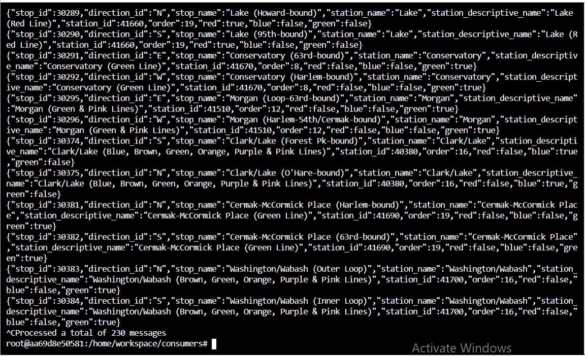

# Optimizing Public Transportation

## Overview
In this project, I constructed a streaming event pipeline around Apache Kafka and its ecosystem. Using public data from the Chicago Transit Authority we constructed an event pipeline around Kafka that allows us to simulate and display the status of train lines in real time.

# Project Directions
The Chicago Transit Authority (CTA) has asked us to develop a dashboard displaying system status for its commuters. We have decided to use Kafka and ecosystem tools like REST Proxy and Kafka Connect to accomplish this task.

1. **Create Kafka Producers**
The first step in our plan is to configure the train stations to emit some of the events that we need. The CTA has placed a sensor on each side of every train station that can be programmed to take an action whenever a train arrives at the station.

2. **Configure Kafka REST Proxy Producer**
Our partners at the CTA have asked that we also send weather readings into Kafka from their weather hardware. Unfortunately, this hardware is old and we cannot use the Python Client Library due to hardware restrictions. Instead, we are going to use HTTP REST to send the data to Kafka from the hardware using Kafka's REST Proxy.

3. **Configure Kafka Connect**
Finally, we need to extract station information from our PostgreSQL database into Kafka. We've decided to use the Kafka JDBC Source Connector.

4. **Configure the Faust Stream Processor**
We will leverage Faust Stream Processing to transform the raw Stations table that we ingested from Kafka Connect. The raw format from the database has more data than we need, and the line color information is not conveniently configured. To remediate this, we're going to ingest data from our Kafka Connect topic, and transform the data.

5. **Configure the KSQL Table**
Next, we will use KSQL to aggregate turnstile data for each of our stations. Recall that when we produced turnstile data, we simply emitted an event, not a count. What would make this data more useful would be to summarize it by station so that downstream applications always have an up-to-date count.

6. **Create Kafka Consumers**
With all of the data in Kafka, our final task is to consume the data in the web server that is going to serve the transit status pages to our commuters.

## Running the simulation
There are two pieces to the simulation, the producer and consumer. 

Run the producer and the consumer at the same time.


To run the producer:

If using Project Workspace:

cd producers
python simulation.py
If using your computer:

```
cd producers
virtualenv venv
. venv/bin/activate
pip install -r requirements.txt
python simulation.py
```
Once the simulation is running, you may hit Ctrl+C at any time to exit.

To run the Faust Stream Processing Application:
```
cd consumers
virtualenv venv
. venv/bin/activate
pip install -r requirements.txt
faust -A faust_stream worker -l info
```

To run the KSQL Creation Script:
```
cd consumers
virtualenv venv
. venv/bin/activate
pip install -r requirements.txt
python ksql.py
```

To run the consumer: (NOTE: Do not run the consumer until you have reached Step 6!)
```
cd consumers
virtualenv venv
. venv/bin/activate
pip install -r requirements.txt
python server.py
```

# Outputs
You can view the 230 stations defined in Postgres using:
`kafka-console-consumer --bootstrap-server localhost:9092 --topic "org.chicago.cta.stations" --from-beginning` to get
the following output.


